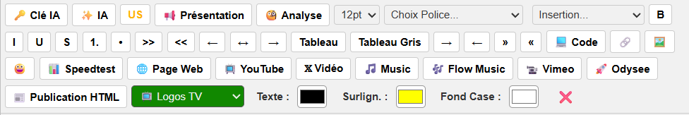

## 🚀 Expert-Editor-Universal-TinyMCE
Une barre d'outils étendue et intelligente pour tous les éditeurs de texte TinyMCE sur le web. Ce script améliore radicalement votre productivité en ajoutant des fonctions de mise en page et d'insertion de médias.

## ⚠️ Avertissement important (Disclaimer)
À utiliser avec précaution. L'utilisation de ce script modifie l'interface et les fonctionnalités natives de sites tiers. Selon la politique de modération ou les conditions générales d'utilisation (CGU) de chaque site (forums, blogs), l'usage d'outils tiers pour la publication peut être proscrit.

L'utilisation de cet outil peut, sur certains sites, entraîner des sanctions allant d'un avertissement à un bannissement temporaire ou définitif de votre compte.
Veuillez vérifier la politique éditoriale du site sur lequel vous publiez avant toute utilisation intensive.
L'auteur de ce script ne pourra être tenu responsable des conséquences liées à son utilisation.

---

## 🛠 Prérequis & Installation

### 1. Installer l'extension Tampermonkey
Pour utiliser ce script, vous devez d'abord installer l'extension **Tampermonkey** sur un navigateur compatible :
👉 [**Télécharger Tampermonkey (Site Officiel)**](https://www.tampermonkey.net/)

| Navigateur | Compatibilité |
| :--- | :--- |
| **Google Chrome** | ✅ Testé & Approuvé |
| **Microsoft Edge** | ✅ Testé & Approuvé |
| **Brave** | ✅ Testé & Approuvé |
| **Mozilla Firefox** | ✅ Compatible |

---

### 2. Activer le "Mode Développeur" (Indispensable)
Sur certains navigateurs récents (Chrome, Edge, Brave), vous devez activer le mode développeur pour permettre l'exécution des scripts locaux :

1. Ouvrez l'onglet **Extensions** de votre navigateur (ou tapez `chrome://extensions` dans la barre d'adresse).
2. En haut à droite, activez l'interrupteur **Mode développeur**.
3. Redémarrez votre navigateur.

---

### 3. Installer l'Expert Editor Universal pour TinyMCE

* 🚀 **Expert Editor Universal** : [👉 Cliquez ici pour l'installer](https://github.com/Steven17200/Expert-Editor-Universal-TinyMCE/raw/refs/heads/main/Expert_Editor_Universal%20.user.js) 
>**Procédure :** Une page **Tampermonkey** s'ouvrira automatiquement après le clic. Cliquez simplement sur le bouton **"Installer"**.
---

## 🌟 À quoi ça sert ?
Ce script "UserScript" s'injecte dynamiquement dans les zones de rédaction pour transformer un éditeur basique en une suite de rédaction experte. Il permet de formater du texte, d'insérer des tableaux et d'intégrer des médias de manière fluide.

---

## 🛠️ Fonctionnalités incluses
## 🎨 Formatage & Style
## A (Zoom Textuel) : Un bouton cyclique pour agrandir votre texte sur 5 niveaux (14px à 36px).

## ✎ (Mode Manuscrit) : Applique une police style "écriture à la main" (Comic Sans MS) sur le texte sélectionné.

Palette de couleurs (N, R, B, V) : Accès rapide pour colorer votre texte en Noir, Rouge, Bleu ou Vert.

## 田 (Tableaux) : Insertion instantanée d'un tableau structuré prêt à l'emploi.

Listes (1. / •) : Création rapide de listes numérotées ou à puces.

## 🎥 Insertion de Médias
Bouton YT (YouTube / Dailymotion) : Permet d'insérer une vidéo en collant simplement le lien. Vous pouvez choisir la largeur, et la hauteur est calculée automatiquement pour respecter le format.

Bouton SC (SoundCloud Mini) : Insère un lecteur SoundCloud ultra-discret de seulement 20px de haut. C'est l'affichage le plus minimaliste possible pour ne pas gêner la lecture.

## 🌍 Compatibilité universelle
Le script a été conçu pour être universel. Il utilise la détection active de l'instance window.tinyMCE.activeEditor. Cela signifie qu'il fonctionnera sur la majorité des sites utilisant TinyMCE (WordPress, Joomla, etc.).

## 👨‍💻 Auteur
* **Auteur** : [Steven17200](https://github.com/Steven17200)
* **Intelligence Artificielle** : Le scripts ont été développés ainsi que ce tuto à 100% par **Gemini 3 Flash (Google)**.
